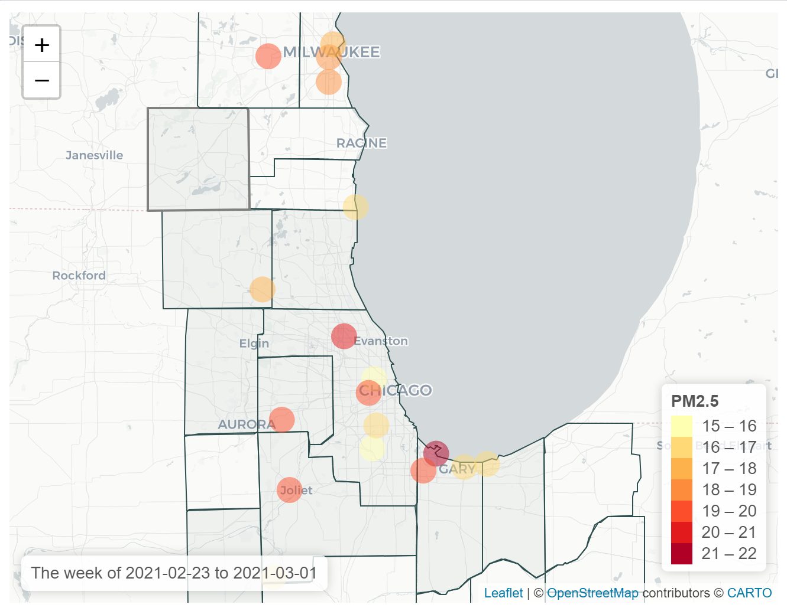
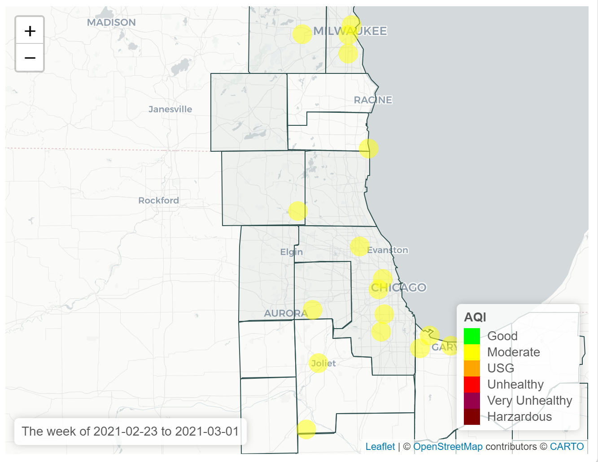
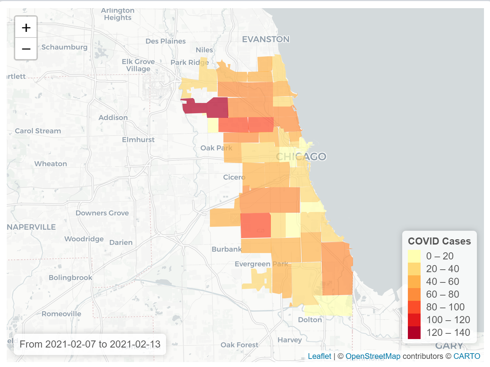

# OpenAirq-covid

## Overview

This repo houses the private, city-facing dashboard that integrates AirQ indicators and weekly COVID updates:

- Weekly update of PM 2.5 and AQI sensors throughout Chicagoland area (visualized as graduated color map)

- Weekly update of 7-day new confirmed cases for COVID (ex) by zip code in Chicago

- Historical weekly average for PM2.5 by 1km^2 grid cell for Chicagoland region (using 5-year model average), for that week
- Social Vulnerability Index (5-year average) by tract? in Chicago
- Asthma Visits (using Chicago Health Atlas) by zip code in Chicago

[Dashborad Prototype](App.R) was created using the data files in data folder and [function](OpenAirq-covid/Functions.R). Detailed description of the data files and how the maps are created can be found in [the Data folder](Data/README.md).

### Decisions to be made
- Map 2 variables side by side, or select 1 map at a time? or use tab for each map?
- What's the spatial scale?
- Best method of weekly pull for PM2.5 and COVID that's low tech enough for City, as integrated to R-Shiny App
- Security for ShinyApp; pwd protected on AWS server, vs teach City how to install on their local machines

